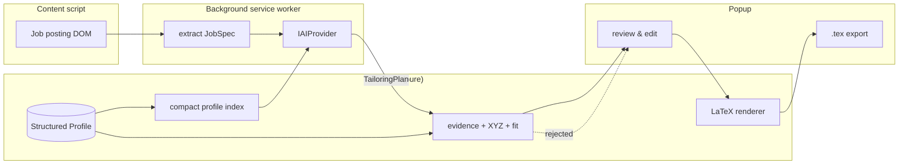
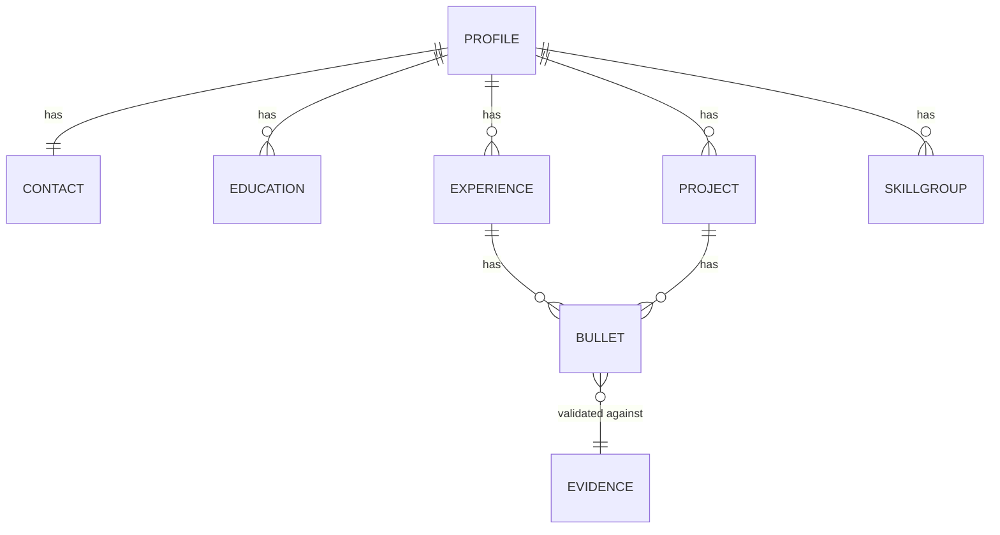
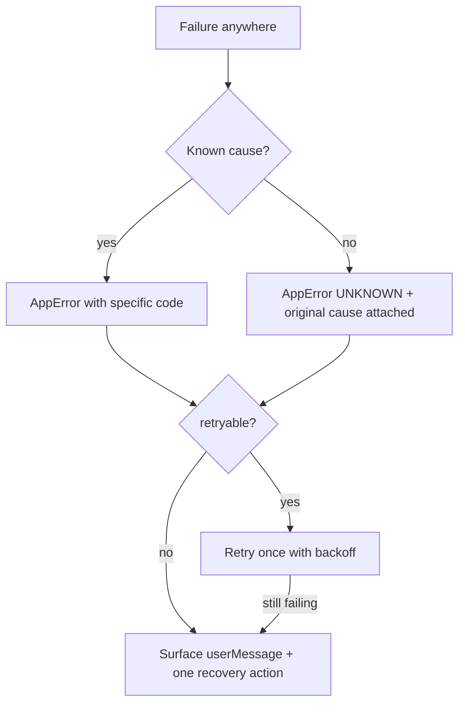

# ResumeTailor — Architecture

## 1. What this thing is

A browser extension that turns **one Structured Profile** plus **one job description** into **one page of LaTeX**.

Three constraints shape every decision below:

1. **The Structured Profile is the single source of truth.** No resume text exists anywhere else. The model never authors facts — it selects and rephrases what the profile already contains.
2. **Provider-agnostic.** Users bring their own key and model. Core code has never heard of OpenAI.
3. **Token efficiency is architectural, not a prompt trick.** The model receives an index, not a resume, and returns a plan, not a document.

A fourth, added later and covered in §4a: **an API key buys better output, never the first output.** Every stage of the pipeline has a local implementation, so the tool works — genuinely, not as a demo — before the user has configured anything.

---

## 2. Tech stack

| Layer | Choice | Why |
|-------|--------|-----|
| Language | TypeScript, `strict: true` | The data model *is* the product; types are the spec |
| Build | Vite + `vite-plugin-web-extension` | One source, three browser targets, MV3 out of the box |
| UI | Preact + Signals | ~4 KB; a form and a review list do not need React |
| Styling | Plain CSS with custom properties | No build-time CSS dependency to maintain |
| Extension API | `webextension-polyfill` | `browser.*` promises everywhere; Chrome and Firefox agree |
| Storage | `chrome.storage.local` | Survives restarts, not synced (the key must not leave the machine) |
| Validation | Hand-rolled type guards in `core/profile/schema.ts` | One dependency avoided; the schema is small and stable |
| Tests | Vitest | Same Vite pipeline, no second config |
| Output | `.tex` (FAANGPath Simple) | Compiles anywhere; PDF-in-browser is P2, not P0 |

**Zero runtime dependencies in `src/core/`.** Core is plain TypeScript: no DOM, no `chrome.*`, no network. It is unit-testable in Node and portable to a CLI or web app later. Everything platform-specific lives at the edges.

---

## 3. Folder structure

```
resume-tailor/
├── AI_RULES.md            # hard rules for AI contributors
├── .cursorrules           # same rules, editor-readable
├── README.md
├── CONTRIBUTING.md
├── .env.example           # dev-only; the extension itself has no .env
├── docs/
│   ├── TODO.md            # current + next phase
│   ├── backlog.md         # everything, prioritised
│   ├── architecture.md    # this file
│   ├── PDP.md             # product definition
│   └── memory.md          # decision log — read before changing anything
├── templates/
│   └── faangpath-simple.tex   # font/size/margin knobs at the top
├── src/
│   ├── core/              # pure TS. No DOM. No chrome.*. No fetch.
│   │   ├── types/         # profile.ts job.ts tailoring.ts provider.ts errors.ts
│   │   ├── profile/       # schema, stable IDs
│   │   ├── prompt/        # profile+JobSpec -> compact messages; response parsing; resume import
│   │   ├── validate/      # evidence check, XYZ linter, one-page fit
│   │   └── render/        # TailoringPlan -> .tex
│   ├── providers/         # openai.ts anthropic.ts gemini.ts openai-compatible.ts registry.ts
│   ├── background/        # MV3 service worker: network calls live here only
│   ├── content/           # job-description extraction from the active tab
│   ├── ui/                # popup/ options/ components/
│   └── shared/            # storage wrapper, messaging contract, settings
└── tests/
```

**The `core` rule:** if a file in `src/core/` imports from `src/providers/`, `src/ui/`, or touches `chrome.*`, the layering is broken. Dependencies point inward only.

---

## 4. Data flow



Read the arrows carefully: **the profile reaches the renderer directly.** The model's plan only says *which* items and *how they are worded*. Full text — contact details, dates, role notes — is joined in locally. A compromised or hallucinating model cannot change a date.

---

## 4a. Two modes, one pipeline

The pipeline has four stages, and a model is an *upgrade to individual stages* rather than a requirement of the whole. Each stage has a local implementation that costs nothing and sends nothing:

| Stage | Local (Quick Mode) | Model-assisted (Pro Mode) |
|-------|--------------------|---------------------------|
| Resume text → `Profile` | `core/profile/read.ts` — headings, date ranges, bullet markers | `core/prompt/import.ts` — one call, for layouts the reader cannot follow |
| JD text → `JobSpec` | `core/prompt/jobspec.ts` — vocabulary match, already the default | `core/prompt/jobspec-fallback.ts` — fills gaps only when heuristics come back thin |
| `Profile` + `JobSpec` → `TailoringPlan` | `core/plan/local.ts` — selects and orders by term overlap. **No rewording** | `core/prompt/messages.ts` — selects, orders *and* rewords toward the posting's language |
| Plan → `.tex` | identical — `core/tailor.ts`, then `core/render/latex.ts` | identical |

**Quick Mode is not a preview.** A plan with no rewrites is a complete plan: with no rewrite for a bullet id the renderer falls back to the profile's own text (D-021), so the output is a real one-page resume with the right bullets in the right order, in the user's own words. What a key buys is the fourth column of the third row — bullets reworded toward the posting's wording — and nothing else.

This makes the privacy story the opposite of the usual one. **Quick Mode is the most private mode**, not the degraded one: nothing leaves the browser at all, because nothing needs to. "Pro" names a capability, not a tier of trust.

```
                  no key                       with key
resume ──▶ read.ts ────────┐      resume ──▶ import.ts ──┐
                           ▼                             ▼
                      Profile (draft, saved only when the user says so)
                           │
JD ──▶ jobspec.ts ─────────┤      JD ──▶ jobspec + fallback
                           ▼
             plan/local.ts │ prompt/messages.ts + parse.ts
                           ▼
              validate ──▶ render ──▶ one page of .tex
```

A third tier — a hosted free-tier endpoint for users who want rewording without a key of their own — slots in as one more `ProviderId` and changes nothing else. It is not built, and it cannot be built without amending invariant 6 in `docs/memory.md` first: a proxy is a backend, and this codebase currently promises there is none. See D-065 to D-072.

---

## 5. The Structured Profile

One JSON document, versioned, stored locally, owned by the user.



### Stable IDs

Every selectable item carries a short, permanent ID: `e1` (experience), `e1b3` (its third bullet), `p2`, `p2b1`, `s1`. Two reasons:

- The model returns `["e1b3","e2b1"]` instead of re-emitting paragraphs. Roughly 20× cheaper per bullet.
- IDs survive edits, so a cached `TailoringPlan` stays valid when the user fixes a typo.

IDs are assigned once on creation and never reused, even after deletion.

### Role notes

A role may carry an optional `note`: one or two lines of context a bullet cannot
carry — a contract or payroll arrangement, a short tenure, a leave of absence, a
relocation.

The content is **always the user's own words**. This codebase ships no default
notes, no suggested wording, and no examples that could end up on someone's
resume by accident. It is a field, not a feature with opinions.

What the code does guarantee about a note the user has written:

- **Never sent to a provider.** Notes are absent from `ProfileIndex`, so no model
  sees one and none can rephrase it.
- **Never dropped.** A plan that omits a role carrying a note still renders the
  role and the note — otherwise the point of writing it is silently defeated.
- **Never altered.** Rendered verbatim (LaTeX-escaped), byte for byte.

Length is capped (`MAX_NOTE_CHARS`) purely so a pasted paragraph cannot eat the
one page. That is the only judgement the code makes about a note.

---

## 6. Token efficiency

The naive design sends the whole resume and gets a whole resume back — roughly 3–4 k tokens per tailoring, most of it text that came from the user in the first place. ResumeTailor sends an index and receives a plan.

| Stage | What crosses the wire | Approx. tokens |
|-------|----------------------|-----------------|
| JD → `JobSpec` | JD text (truncated ~1200 words), heuristics run first and can skip the call entirely | ~400 in / ~120 out |
| Profile → index | `id`, first ~90 chars of each bullet, skill names. No dates, no contact, no notes, no URLs | ~500 in |
| Plan back | Selected IDs, order, rewritten bullets **only for what was selected** | ~350 out |
| Render | Nothing — local | 0 |

Five rules that keep it there:

1. **Send IDs, not prose.** Anything already on disk is joined locally.
2. **Truncate the index.** 90 characters is enough for the model to know what a bullet is about; the renderer has the full text.
3. **Rewrite only what is selected.** Typically 12–16 bullets of 40+.
4. **Heuristics before the model.** Keyword extraction, skill matching, keyword coverage and one-page fit are pure local computation. Never spend a token on arithmetic.
5. **Cache by content hash.** Same profile + same JD = same plan, zero tokens. Re-tailoring after a typo fix reuses the plan.

Non-goals: streaming (optional on the interface, off by default — it costs the same and complicates validation), and multi-turn refinement (each refinement is a fresh single call with a delta instruction).

---

## 7. `IAIProvider`

The one seam that matters. Full definition in [`src/core/types/provider.ts`](../src/core/types/provider.ts).

```ts
interface IAIProvider {
  readonly id: ProviderId;
  readonly label: string;
  complete(req: CompletionRequest, signal?: AbortSignal): Promise<CompletionResult>;
  estimateTokens(text: string): number;
  validateConfig(config: ProviderConfig): Promise<ValidationOutcome>;
}
```

Deliberately narrow:

- **One method that talks to a network.** Adding a provider means one file, no core changes.
- **JSON-shaped requests, not chat transcripts.** `CompletionRequest` carries `system`, `user`, and `expectJson`. Providers translate to their own wire format — including the ones that need `response_format`, a tool call, or a naked prompt.
- **`estimateTokens` is a heuristic**, not a tokenizer. Bundling three tokenizers to display a cost estimate is not worth 2 MB. Characters ÷ 3.7, documented as approximate.
- **`validateConfig` gives settings a real "Test connection".** Bad keys fail at save time, not mid-tailoring.
- **No streaming in the base interface.** A provider may add `stream?()`; nothing in core calls it.

Providers never throw vendor errors upward. They map every failure to an `AppError` code (§8) — an HTTP 429 becomes `RATE_LIMITED`, a 401 becomes `AUTH_FAILED`. Core handles four cases, not forty.

---

## 8. Error handling

One error type. Every failure is an `AppError` with a machine `code`, a `userMessage` written for a human, and a `retryable` flag. No bare `throw new Error()` outside `core/types/errors.ts`, and no `catch {}` that swallows.



Rules:

- **Every code has a hand-written message.** No stack traces, no JSON, no "Error: undefined". If a message cannot be written for a code, the code is wrong.
- **Every surfaced error offers one action:** open settings, retry, paste manually, edit profile.
- **Retry exactly once**, and only for `RATE_LIMITED`, `NETWORK`, `TIMEOUT`. Anything else fails immediately — a wrong API key will still be wrong in 2 seconds.
- **Never fail silently and never half-render.** A rejected `TailoringPlan` shows the user what was rejected and why; it does not quietly drop a bullet.
- **The original cause is preserved** in `AppError.cause` for the console, never for the UI.

---

## 9. Anti-hallucination

The instruction "never invent content" is not a defence; it is a request. The structure is the defence.

1. The model receives a **truncated index**. It does not have enough text to plausibly fabricate detail about a project it can only see 90 characters of.
2. The model returns **IDs plus rewrites**. An ID that is not in the profile is rejected outright.
3. **Evidence validation** (`core/validate/evidence.ts`): every number, percentage, currency amount, and capitalised proper noun in a rewritten bullet must appear in the *source* bullet it claims to rewrite. "Reduced latency by 40%" is rejected unless the source says 40%.
4. Dates, employers, titles, contact details and role notes **never pass through the model at all** — they are joined locally at render.

**Resume import is the one call where the model does see full text**, because it is transcribing a document the user supplied rather than writing about them. The defences there are different in mechanism and identical in intent: it is told to keep the candidate's wording and add no fact; it cannot return a role note (no such key in the response shape) or an ID (allocated locally); a date it cannot read comes back blank rather than guessed; and nothing it produces is written to storage until the user has seen every field and pressed save. See decisions D-060 to D-064.

A failed evidence check is not a silent fallback. The user is shown the offending bullet and the original, and chooses: keep original, or retry.

**Quick Mode cannot fabricate at all**, by construction rather than by checking: a local plan is a list of ids the planner chose from the profile, with an empty `rewrites` array. There is no generated text in it to validate. It still goes through `validatePlan` unchanged — an empty rewrite list passes every check — because a second code path around the validator is exactly how one eventually ships without it.

---

## 10. One page

The mandatory constraint that cannot be verified without a LaTeX compiler — an honest limitation, handled honestly.

`core/validate/fit.ts` estimates rendered height from the plan: line count per bullet at the configured font size and text width, plus per-section vertical spacing, against a US-Letter budget. It returns `ok | tight | over` with a line count, never a fake percentage.

- `over` blocks export and shows the cheapest cuts (longest bullets, weakest keyword coverage).
- `tight` warns and offers font/margin knobs — which is why they sit at the top of the template.
- The estimator is deliberately **conservative**: it would rather warn wrongly than ship a two-page resume.

Exact measurement arrives with in-browser compilation (backlog P-29). Until then the UI says "estimated", because it is.

---

## 11. Cross-browser (MV3)

| Concern | Chrome / Edge | Firefox |
|---------|---------------|---------|
| Background | `service_worker` | `scripts` (event page) — both entries in the manifest; the build strips the wrong one |
| Namespace | `chrome.*` | `browser.*` — polyfill, and code uses `browser.*` everywhere |
| Host permissions | optional, requested at capture time | same |
| Extension ID | — | `browser_specific_settings.gecko.id` required |

One codebase, three targets, `vite build --mode chrome|firefox|edge`. Edge is Chrome with a different store listing.

**Permissions, minimum viable:** `storage`, `activeTab`, `scripting`. No `<all_urls>`; host access is requested when the user clicks capture, on that tab only. The extension can only talk to the provider endpoint the user configured.

---

## 12. Privacy

- Profile and API key live in `storage.local` on one machine. Never `storage.sync`.
- The only outbound request goes to the provider the user configured. No analytics, no telemetry, no home server. There is no backend.
- `storage.local` is not encrypted; anyone with the browser profile can read the key. This is stated in the settings UI and the README rather than hidden behind a lock icon.
- Job descriptions are sent to the user's chosen provider. Said plainly before the first tailoring, not buried in a policy.
